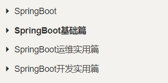
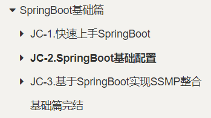
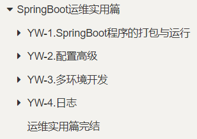

# Java面试

## Java基础

<a href="main/Java-interview/Java基础.html">Java基础</a>

## 面试汇总

<a href="main/Java-interview/Java-interview.html">Java面试</a>

## MySql

<a href="main/Java-interview/Mysql.html">Mysql</a>

## Redis

<a href="main/Java-interview/Mysql.html">Redis</a>

---

# SpringBoot

## 汇总篇

<a href="main/SpringBoot/SpringBoot讲义-汇总.html">汇总篇</a>

## 基础篇

<a href="main/SpringBoot/SpringBoot讲义-基础篇.html"> 基础篇</a>

## 运维实用

<a href="main/SpringBoot/SpringBoot讲义-运维实用篇.html"> 运维实用篇</a>

## 开发实用篇

<a href="main/SpringBoot/SpringBoot讲义-开发实用篇.html"> 开发实用篇</a>

------

# SpringCloud

## 实用篇

### SpringCloud

<a href="main/SpringCloud/实用篇/SpringCloud/SpringCloud.html"> SpringCloud</a>

### Docker

<a href="main/SpringCloud/实用篇/Docker/Docker.html"> Docker</a>

### MQ

<a href="main/SpringCloud/实用篇/MQ/RabbitMQ.html"> RabbitMQ</a>

## Redis

<a href="main/SpringCloud/实用篇/Redis/Redis.html"> Redis</a>

### Elasticsearch

<a href="main/SpringCloud/实用篇/Elasticsearch/分布式搜索引擎.html"> Elasticsearch</a>

## 高级篇

### 微服务保护

<a href="main/SpringCloud/高级篇/1-微服务保护/微服务保护.html"> 微服务保护</a>

### 分布式事务

<a href="main/SpringCloud/高级篇/2-分布式事务/分布式事务.html">分布式事务</a>

### 分布式缓存

<a href="main/SpringCloud/高级篇/3-分布式缓存/分布式缓存.html">分布式缓存</a>

### 多级缓存

<a href="main/SpringCloud/高级篇/4-多级缓存/多级缓存.html">多级缓存</a>

### MQ高级

<a href="main/SpringCloud/高级篇/5-MQ高级/RabbitMQ-高级篇.html">MQ高级</a>

## 面试篇

<a href="main/SpringCloud/面试篇/微服务常见面试题.html">微服务常见面试题</a>

------

------

# Mysql

## mysql进阶

<a href="main/Mysql/Mysql进阶.html">Mysql进阶</a>

